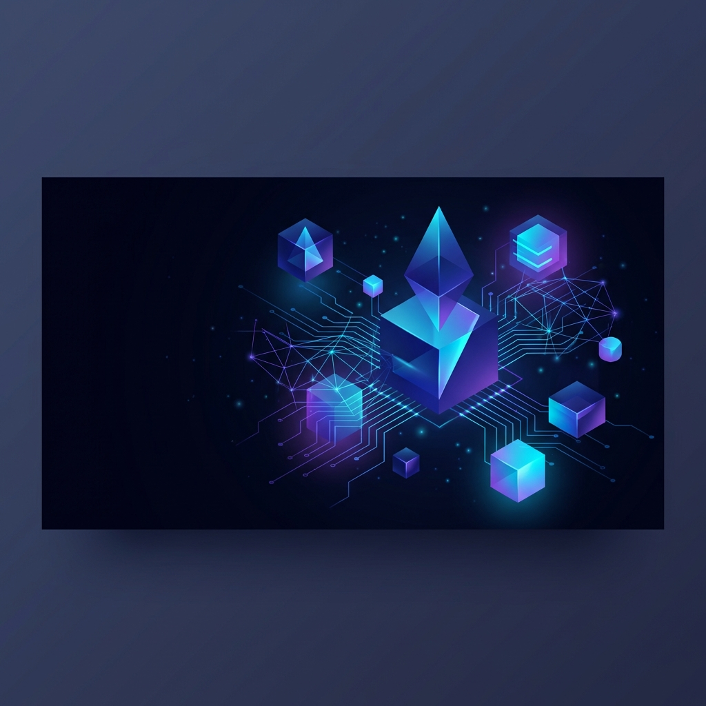

<p align="center">
  
</p>

# 🌌 Antigravity Custom Skills

> **賦予你的 AI 代理人超越極限的能力。**

這是一個為 Antigravity AI 代理人量身打造的自定義技能（Skills）與工作流（Hooks）儲存庫。這裡整合了超過 50 個專業技能，涵蓋從 3D 體驗開發、後端架構設計到自動化測試的方方面面。

---

## 🚀 快速上手

要開始使用這些技能，請確保你的專案結構中包含 `.gemini/skills` 目錄，並將所需的技能資料夾複製進去。

```bash
# 複製特定技能到你的專案
cp -r custom-skills/gemini/skills/frontend-design path/to/your/project/.gemini/skills/
```

---

## 🛠️ 強大技能庫 (Featured Skills)

以下是我們精心挑選的部分核心技能分類：

| 類別 | 技能名稱 | 描述 |
| :--- | :--- | :--- |
| **🎨 視覺與設計** | [frontend-design](gemini/skills/frontend-design) | 建立高品質、生產級的前端介面。 |
| | [3d-web-experience](gemini/skills/3d-web-experience) | 專精於 WebGL, Three.js 的 3D 沉浸式體驗。 |
| | [ui-ux-pro-max](gemini/skills/ui-ux-pro-max) | 具備 50+ 風景與 20+ 調色盤的 UI/UX 設計智能。 |
| **🏗️ 架構與開發** | [backend-architect](gemini/skills/backend-architect) | 建立高效能、強型別的分層後端系統。 |
| | [typescript-expert](gemini/skills/typescript-expert) | 處理複雜型別體操與效能優化的專家。 |
| | [clean-code](gemini/skills/clean-code) | 實行簡潔、直接、無過度工程的編碼標準。 |
| **🧪 測試與品質** | [playwright-skill](gemini/skills/playwright-skill) | 完整的瀏覽器自動化測試解決方案。 |
| | [qa-test-engineer](gemini/skills/qa-test-engineer) | 確保邏輯正確性與高測試覆蓋率。 |
| | [test-fixing](gemini/skills/test-fixing) | 系統化修復失敗測試的智能工具。 |
| **🔧 運維與自動化** | [docker-expert](gemini/skills/docker-expert) | 多階段構建與容器安全硬化專家。 |
| | [github-workflow](gemini/skills/github-workflow-automation) | 自動化 PR 審閱與 CI/CD 流程。 |
| | [gcp-cloud-run](gemini/skills/gcp-cloud-run) | 部署生產級 Serverless 應用的最佳實踐。 |

> [!TIP]
> 完整的技能清單位於 [gemini/skills](gemini/skills) 目錄下。

---

## ⚓ 自動化 Hooks

專案內建了一系列 git 鉤子與自動化腳本，幫助你維持程式碼品質：

- 🛡️ **[block-secrets.sh](gemini/hooks/block-secrets.sh)**: 防止機敏資訊（如 API Keys）被提交。
- 📝 **[audit-log.sh](gemini/hooks/audit-log.sh)**: 自動記錄變更日誌。
- ✨ **[auto-format.sh](gemini/hooks/auto-format.sh)**: 提交前自動格式化程式碼。
- 🔗 **[inject-git-context.sh](gemini/hooks/inject-git-context.sh)**: 在 AI 對話中注入 Git 狀態上下文。

---

## 🤝 如何貢獻

1. 參考 [README.md](gemini/skills/README.md) 中的技能規範。
2. 在 `gemini/skills` 建立新目錄。
3. 撰寫 `SKILL.md` 並提供範例。
4. 提交 Pull Request！

---

<p align="center">
  Made with ❤️ by the Antigravity Team
</p>
