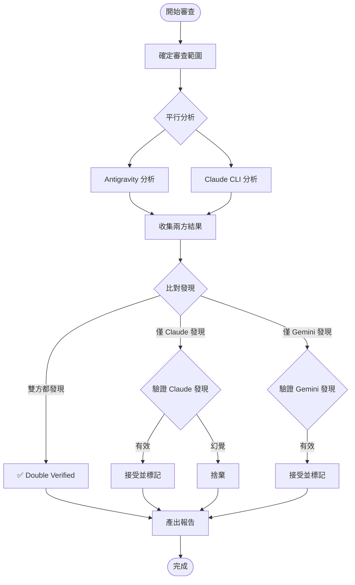

# Dual Code Review Protocol

透過 Gemini 與 Claude CLI 的雙重審查，產出高可信度的程式碼審查報告。

## 決策流程圖



## Workflow

### 1. 確定審查範圍

```bash
# 選項 A: 暫存區變更
git diff --staged > /tmp/review_content.txt

# 選項 B: 與 main 分支比較
git diff main > /tmp/review_content.txt

# 選項 C: 特定檔案
cat src/auth/*.ts > /tmp/review_content.txt
```

### 2. 雙重分析

#### A. Claude CLI 分析（使用管道模式）

```bash
# 唯讀審查，強制 JSON 輸出
cat /tmp/review_content.txt | claude -p \
  "你是資深程式碼審查員。請審查以下程式碼變更。
   重點關注：Bug、安全性、效能、可讀性。
   以 JSON 格式回傳發現。" \
  --output-format json \
  --json-schema '{
    "type": "object",
    "properties": {
      "findings": {
        "type": "array",
        "items": {
          "type": "object",
          "properties": {
            "severity": {"type": "string", "enum": ["High", "Medium", "Low"]},
            "category": {"type": "string"},
            "file": {"type": "string"},
            "line": {"type": "integer"},
            "message": {"type": "string"},
            "suggestion": {"type": "string"}
          },
          "required": ["severity", "category", "message"]
        }
      },
      "summary": {"type": "string"}
    }
  }' \
  --allowedTools "Read,Grep,Glob" \
  --max-turns 5 | jq '.structured_output' > /tmp/claude_review.json
```

#### B. Antigravity 分析

Gemini 同步進行獨立分析，在讀取 Claude 結果前先完成自己的判斷，以維持獨立性。

### 3. 共識與綜合

**評估邏輯：**

| 情況 | 處理方式 | 標籤 |
|------|---------|------|
| 雙方都發現相同問題 | 確認為高可信度問題 | `[Double Verified]` |
| 僅 Claude 發現 | 驗證是否為幻覺，有效則接受 | `[Claude CLI Detected]` |
| 僅 Gemini 發現 | 再次確認，有效則保留 | `[Antigravity Detected]` |

### 4. 產出報告

**報告結構：**

```markdown
# Code Review Report

## Summary
- **Status**: Pass / Request Changes
- **Files Reviewed**: X
- **Issues Found**: High: X, Medium: X, Low: X

## Consensus Highlights
> 雙方一致認為的關鍵問題

## Detailed Findings

### 🔴 High Severity
| Issue | File | Line | Source |
|-------|------|------|--------|
| ... | ... | ... | [Double Verified] |

### 🟡 Medium Severity
...

### 🟢 Low Severity
...

## Actionable Advice
1. 修復步驟...
```

## 兩階段執行（先審查後修復）

```bash
# 階段一：唯讀審查
review=$(git diff --staged | claude -p \
  "審查這些變更，列出所有問題" \
  --allowedTools "Read,Grep,Glob" \
  --output-format json)

# 階段二：自動修復（需人工確認）
echo "$review" | jq -r '.result' | claude -p \
  "依照以下審查結果修復問題：$(cat)" \
  --allowedTools "Read,Edit,Write" \
  --max-turns 10
```

## 觸發條件

當使用者提及以下關鍵字時啟用此技能：
- "Dual Review" / "雙重審查"
- "Double Check" / "雙重檢查"
- "Mutual Review" / "交叉審查"
- "Review Process" / "審查流程"
