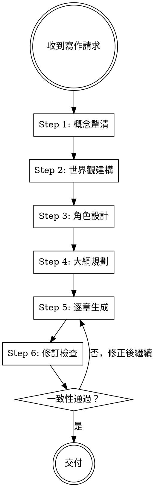

# Novel Generation

## Overview

結構化的小說創作流程。核心原則：**先建骨架，再長血肉**——世界觀、角色、大綱必須在動筆前完成，逐章生成時維護一致性。

## When to Use

- 使用者要求撰寫小說、短篇、章節、連載
- 使用者提供故事概念想要展開
- 使用者要求角色開發或世界觀建構

**不適用：** 非虛構寫作、部落格、技術文件、詩詞

## Core Workflow



## Step 1: 概念釐清

動筆前必須確認：

| 項目 | 說明 | 預設值 |
|------|------|--------|
| 類型與風格 | 載入對應 `styles/*.md` | 無，必選 |
| 主題 | 一句話概要 (logline) | 無，必填 |
| 篇幅 | 短篇(3k-10k)／中篇(10k-50k)／長篇(50k+) | 短篇 |
| 視角 | 第一人稱／第三人稱有限／第三人稱全知 | 第三人稱有限 |
| 語氣 | 嚴肅／輕鬆／黑色幽默／抒情 | 依風格檔 |
| 讀者定位 | 年齡層、閱讀習慣 | 一般成人 |
| 語言 | 繁中／簡中／英文／日文 | 繁中 |

**風格可疊加**——「推理 + 吐槽對話」同時載入兩個風格檔，取各自的節奏與檢查規則。

## Step 2: 世界觀建構

輸出一份**設定文件**，包含：

- 時空背景（年代、地點、科技/魔法水平）
- 世界規則（什麼可以做、什麼不能做）
- 社會結構（權力來源、階級、衝突根源）
- 限制條件（角色能力的天花板、代價）

**篇幅控制：** 短篇只需 3-5 條核心規則，不要過度建構。

## Step 3: 角色設計

每個主要角色建立**角色卡**：

```
【角色名】
- 外在目標：想要達成什麼？
- 內在需求：真正缺少什麼？
- 致命缺陷：什麼弱點會阻礙他？
- 說話方式：口頭禪、句式、語氣詞
- 角色弧線：從 A 狀態 → B 狀態
```

**避免標籤式描寫**——不要堆砌「34歲、兩個孩子、鈦合金婚戒」，而是透過行為和選擇展現角色。

## Step 4: 大綱規劃

使用**三幕結構**（或風格檔指定的替代結構）：

- **第一幕 (25%)**：建立世界、角色、核心衝突
- **第二幕 (50%)**：衝突升級、挫折、轉折點
- **第三幕 (25%)**：高潮、解決、餘韻

輸出**章節摘要列表**，每章標註：
- 本章推進什麼衝突
- 本章揭露什麼資訊
- 本章的情緒曲線（起點→終點）

## Step 5: 逐章生成

每章生成前：
1. 回顧前文摘要與角色當前狀態
2. 確認本章在大綱中的位置與目標
3. 檢查風格檔的節奏規則

每章生成後：
1. 角色行為是否符合角色卡？
2. 新資訊是否與已建立的設定矛盾？
3. 是否「展示」而非「告訴」？
4. 角色弧線是否有推進？（角色卡定義的 A→B 轉變，在本章是否有至少微小的進展）

## Step 6: 修訂檢查

### 通用檢查清單

- [ ] 角色行為前後一致
- [ ] 伏筆已回收（或標記待回收）
- [ ] 節奏有起伏（不是全程同一張力）
- [ ] 對話≠敘述——每個角色的聲音不同
- [ ] 開頭有鉤子，結尾有餘韻
- [ ] 「展示 vs 告訴」比例合理

### 風格專屬檢查

載入風格檔中的品質檢查清單，逐項驗證。

### 自證規則

品質檢查不可全部自評「通過」而不舉證。每項檢查必須：
- 標記通過/未通過
- **引用正文中的具體段落或句子**作為證據
- 若有未通過項，必須回到正文修正後再重新檢查

## Story Bible 維護

長篇或連載時，維護一份持續更新的文件：

```
## 角色狀態
- [角色名]: 目前位置、已知資訊、情緒狀態、關係變化

## 時間線
- [章節]: [事件] @ [時間點]

## 伏筆追蹤
| 伏筆 | 埋設章節 | 狀態 | 回收章節 |
|------|---------|------|---------|
| ... | ... | 待回收/已回收 | ... |

## 已確立的世界規則
- [規則]: 首次出現於 [章節]
```

## 可用風格檔

位於 `styles/` 目錄，依需求載入：

### 東方/華文類型

| 風格檔 | 適用類型 |
|--------|---------|
| `xianxia.md` | 玄幻、修仙、仙俠 |
| `wuxia.md` | 武俠、江湖 |
| `romance.md` | 言情、愛情、羅曼史（跨文化通用） |
| `isekai-reborn.md` | 穿越、重生、轉生 |
| `system-power-fantasy.md` | 系統流、爽文、金手指、LitRPG |
| `palace-intrigue.md` | 宮鬥、權謀、政治劇 |

### 西方/經典類型

| 風格檔 | 適用類型 |
|--------|---------|
| `sci-fi.md` | 科幻、賽博龐克、太空歌劇、後末日 |
| `epic-fantasy.md` | 史詩奇幻、高魔奇幻、劍與魔法 |
| `dystopia.md` | 反烏托邦、社會寓言 |
| `gothic.md` | 哥德、暗黑浪漫、古宅秘密 |
| `noir.md` | 黑色小說、硬漢派、犯罪小說 |
| `magical-realism.md` | 魔幻寫實 |

### 跨文化通用

| 風格檔 | 適用類型 |
|--------|---------|
| `comedic-dialogue.md` | 吐槽喜劇、輕小說、荒誕喜劇 |
| `mystery.md` | 推理、偵探、懸疑、密室 |
| `horror-thriller.md` | 恐怖、驚悚、心理恐怖 |
| `literary-fiction.md` | 純文學、文藝小說 |

## Common Mistakes

| 錯誤 | 修正 |
|------|------|
| 直接開寫，跳過大綱 | 至少完成章節摘要列表再動筆 |
| 角色用標籤描寫 | 透過行為、選擇、對話展現角色 |
| 全程同一張力 | 緊張與舒緩交替，高潮前要蓄力 |
| 告訴而非展示 | 「她很生氣」→「她把杯子摔在桌上」 |
| 一稿定案不修訂 | 每章完成後跑檢查清單 |
| 伏筆埋了不回收 | 維護伏筆追蹤表 |
| 所有角色說話一樣 | 每人要有獨特的句式和語氣詞 |
